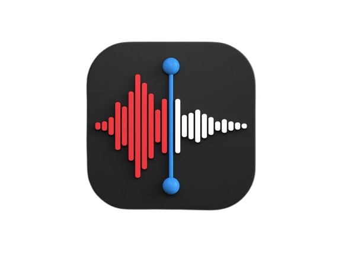
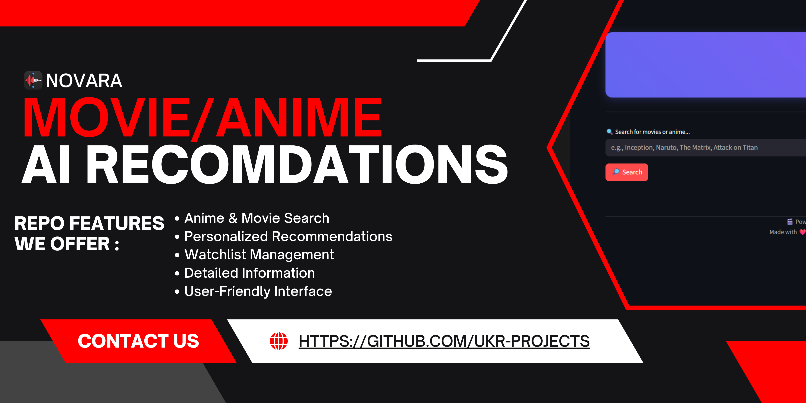
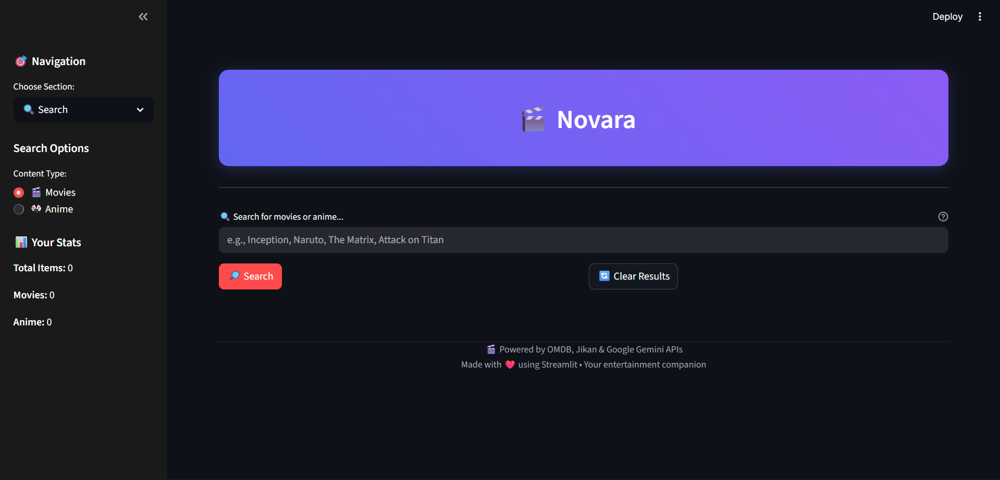

<h1>
  
  Novara
</h1>

[](LICENSE)
[](STATUS.md)
[](CHANGELOG.md)

<div align="center">
  
</div>

<div align="center">
  
</div>

---
## 🖼 Screenshot

<div align="center">
  
  <p><em>GUI Interface</em></p>
</div>

---
## 🎉 What’s New in v1.0.0

- **Initial Release**
  - Novara is launched as a comprehensive entertainment hub.
  - Seamless integration with Jikan API for anime data and OMDb API for movie data.
  - Gemini API integration for personalized recommendations.

---

## ✨ All Features
- **Anime & Movie Search**: Discover a vast library of anime and movies.
- **Personalized Recommendations**: Get tailored suggestions powered by Gemini AI.
- **Watchlist Management**: Keep track of your favorite titles.
- **Detailed Information**: Access comprehensive details for each anime and movie.
- **User-Friendly Interface**: Enjoy a clean and intuitive design.

---

## 📁 Folder Structure

```
Novara/
├── LICENSE
├── pyproject.toml
├── requirements.txt
├── assets/
│   ├── novara-banner.jpg
│   ├── novara-logo.png
│   └── screenshots/
│       └── screenshot.png
├── docs/
│   ├── Blueprint.docx
│   ├── CHANGELOG.md
│   ├── CODE_OF_CONDUCT.md
│   ├── CONTRIBUTING.md
│   ├── README.md
│   ├── SECURITY.md
│   ├── STATUS.md
│   └── USAGE.md
└── src/
    ├── .env
    ├── main.py
    └── app/
        ├── __init__.py
        ├── clients/
        │   ├── __init__.py
        │   ├── googlegemini.py
        │   ├── jikan.py
        │   └── omdb.py
        ├── ui_components/
        │   ├── anime_details.py
        │   ├── cards.py
        │   ├── movie_details.py
        │   ├── styles.py
        │   └── watchlist_display.py
        └── utils/
            ├── api_keys.py
            └── watchlist.py
```
---

## 🕹 Usage

### Prerequisites

- Python 3.8+
- `pip` (Python package installer)
- API Keys for Jikan, OMDb, and Google Gemini (refer to `src/app/utils/api_keys.py` for setup)

### Installation

1. **Clone the repository:**
   ```bash
   git clone https://github.com/nova-cortex/novara.git
   cd novara
   ```

2. **Create a virtual environment (recommended):**
   ```bash
   python -m venv venv
   source venv/bin/activate  # On Windows, use `venv\Scripts\activate`
   ```

3. **Install dependencies:**
   ```bash
   pip install -r requirements.txt
   ```

4. **Set up API Keys:**
   - Create a `.env` file in the `src` directory.
   - Add your API keys as environment variables. Example:
     ```
     OMDB_API_KEY=your_omdb_api_key
     GEMINI_API_KEY=your_gemini_api_key
     ```

5. **Run the application:**
   ```bash
   python src/main.py
   ```

For more detailed documentation, see our [USAGE.md](USAGE.md)

---

## 🤝 Contributing

We welcome contributions to Novara! Please see our [Contributing Guide](CONTRIBUTING.md) for details on how to get started.

---

### Code of Conduct

This project adheres to the [Code of Conduct](CODE_OF_CONDUCT.md). Please read it before contributing.

---

## 📋 Roadmap

- [X] Enhance AI recommendation engine
- [ ] Add more content categories (e.g., books, games)

See the [open issues](https://github.com/nova-cortex/novara/issues) for a full list of proposed features and known issues.

---

## 📝 Changelog

All notable changes to this project are documented in [CHANGELOG.md](CHANGELOG.md).

---

## 📄 License

This project is licensed under the MIT License - see the [LICENSE](../LICENSE) file for details.

---

## 🙏 Acknowledgments

- The Jikan API for anime data.
- The OMDb API for movie data.
- Google Gemini for powerful AI recommendations.
- All contributors and users who support Novara.

---

## 📞 Support

- 🐛 Issues: [Novara Issues](https://github.com/nova-cortex/novara/issues)
- 🔓 Security: [Novara Security](https://github.com/nova-cortex/novara/security)
- ⛏ Pull Request: [Novara Pull Request](https://github.com/nova-cortex/novara/pulls)
- 📖 Docs: [Novara Documentation](https://github.com/nova-cortex/novara/tree/main/docs)
- 📃 Changelog: [Novara Changelog](https://github.com/nova-cortex/novara/blob/main/docs/CHANGELOG.md)

---

## 🔗 Connect


#### 💼 Project Links
[](https://github.com/nova-cortex/novara)

---

<div align="center">
  Made with ❤️ by <a href="https://github.com/nova-cortex">Nova Cortex</a>
</div>

---
